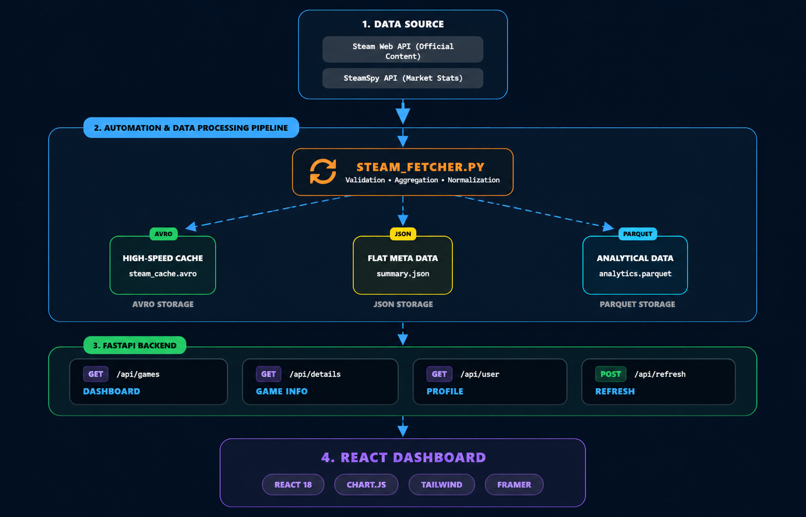

# Steam Web Dashboard 🎮

ระบบ Dashboard แสดงข้อมูลเกมจาก Steam แบบ Real-time พัฒนาด้วย Python (FastAPI) และ React (TypeScript) พร้อมระบบดึงข้อมูลอัตโนมัติด้วย Apache Airflow

## รูปภาพ Diagram


## คุณสมบัติหลัก (Features)
- **Data Fetching**: ดึงข้อมูลจาก Steam Store, SteamSpy และ Steam Web API
- **Real-time Dashboard**: แสดงชื่อเกม, ราคา (ส่วนลด), แนวเกม, และจำนวนผู้เล่นออนไลน์
- **Automation**: ระบบดึงข้อมูลอัตโนมัติทุกชั่วโมงผ่าน Apache Airflow
- **Fast API**: Backend ประสิทธิภาพสูงสำหรับดึงข้อมูลและจัดการ Cache
- **Modern UI**: Frontend สวยงามด้วย TailwindCSS และ Chart.js

## โครงสร้างโปรเจกต์ (Project Structure)
- `backend/main.py`: API Server (FastAPI) และตัวให้บริการไฟล์ Frontend
- `backend/steam_fetcher.py`: ระบบดึงข้อมูล (Fetch), จัดระเบียบข้อมูล (Normalize) และจัดการ Cache
- `dags/steam_dashboard_dag.py`: ไฟล์กำหนดขั้นตอนการทำงานของ Airflow (Hourly DAG)
- `frontend/src/App.tsx`: หน้าจอหลักของ Dashboard (React + TypeScript)
- `data/`: โฟลเดอร์เก็บข้อมูล Cache และประวัติการดึงข้อมูล (Avro/JSON)

## วิธีการติดตั้งและรันโปรเจกต์ (Getting Started)

### 1. การเตรียมสภาพแวดล้อม (Setup)
```bash
# สร้าง Virtual Environment
python -m venv .venv

# เปิดใช้งาน (Windows)
.\.venv\Scripts\activate

# ติดตั้ง Library ที่จำเป็น
pip install -r requirements.txt
```

### 2. การรัน Backend Server
```bash
uvicorn backend.main:app --reload --host 127.0.0.1 --port 8000
```
- เข้าใช้งานผ่าน: [http://127.0.0.1:8000](http://127.0.0.1:8000)

### 3. การดึงข้อมูลด้วยตนเอง (Manual Fetch)
หากต้องการดึงข้อมูลทันทีโดยไม่ผ่าน Airflow:
```bash
python -m backend.steam_fetcher
```

### 4. การตั้งค่า Airflow (ตัวเลือกเสริม)
สำหรับการทำงานแบบอัตโนมัติ:
```powershell
$env:AIRFLOW_HOME = "$PWD\airflow"
airflow db init
airflow standalone
```
*หมายเหตุ: ต้องตั้งค่า `DAGS_FOLDER` ให้ชี้มาที่โฟลเดอร์ `dags` ของโปรเจกต์นี้*

## ข้อมูลที่จัดเก็บ (Data Points)
- ชื่อเกม (Game Name)
- ราคาปัจจุบันและส่วนลด (Price & Discount)
- แนวเกม (Genre)
- รูปภาพหน้าปก (Header Image)
- จำนวนผู้เล่นปัจจุบัน (Current Online Players)

## คำเตือน (Disclaimer)
โปรเจกต์นี้จัดทำขึ้นเพื่อการสาธิต (Demo) ข้อมูล API Key ที่ใช้ในโค้ดควรถูกเก็บเป็นความลับในสภาพแวดล้อมการทำงานจริง (Production)
